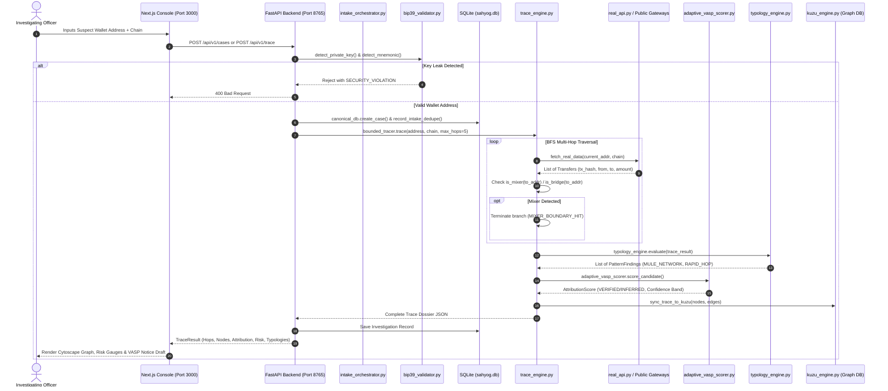

# SIH 26183: Real-Time Crypto Fraud Attribution System (CryptoTrace LEA / TraceX Sahyog)
## Exhaustive Codebase Extraction & Technical Specification

---

### 1. SYSTEM ARCHITECTURE MAP
**Status:** PARTIAL (Dual architecture: Legacy Python engine + New Canonical Layer; Next.js 16 decoupled from FastAPI)

#### Files Involved:
- `app.py`
- `backend/`
- `engine/`
- `frontend/`
- `data/`

#### Full Directory Tree with Single-Line Purpose:
```text
Crypto-Trace-Fin-08ac82779695698a5eab76d43b8a258cfabd9f35/
├── .env                                       # Runtime secrets, API keys, database paths, and model configurations
├── .gitignore                                 # Git exclusion rules for venv, databases, and node_modules
├── .gitmodules                                # Submodule declaration for frontend
├── app.py                                     # FastAPI entrypoint exposing legacy and v1 APIs on port 8765
├── AUDIT.md                                   # Historical architectural audit and live API key verification logs
├── LLM_CONTEXT.md                             # Specification doc detailing requirements and schemas
├── requirements.txt                           # Core runtime Python dependencies
├── requirements-dev.txt                       # Development and test dependencies (pytest, pytest-asyncio)
│
├── backend/                                   # Canonical CryptoTrace LEA Domain Architecture (Phase 1–8)
│   ├── adapters/
│   │   ├── bip39_validator.py                 # Rejects complaints with 12/24-word mnemonics or 64-char hex private keys
│   │   ├── ncrp_adapter.py                    # National Cybercrime Reporting Portal boundary intake adapter
│   │   ├── provider_manager.py                # Regex and pattern validator to classify input blockchain types
│   │   └── sahyog_adapter.py                  # MHA/I4C SAHYOG inter-agency bulletin intake adapter
│   ├── api/
│   │   ├── auth_routes.py                     # JWT authentication and investigator persona endpoints
│   │   ├── case_routes.py                     # Case management, intake, listing, and PDF report downloads
│   │   ├── copilot_routes.py                  # AI Copilot recommendations and grounded Q&A endpoints
│   │   ├── evidence_routes.py                 # Forensic payload retrieval, SHA-256 verification, and audit trail
│   │   ├── intake_routes.py                   # External gateway intake endpoints for NCRP and SAHYOG
│   │   ├── notice_routes.py                   # Section 91 BNSS legal notice drafting and supervisor approval gate
│   │   └── trace_routes.py                    # Bounded multi-hop forensic attribution trace trigger
│   ├── attribution/
│   │   ├── adaptive_vasp_scorer.py            # Primary 6-step context-sensitive VASP attribution scoring engine
│   │   ├── attribution_resolver.py            # Resolves highest-confidence VASP candidate from scored clusters
│   │   └── vasp_registry.py                   # Curated registry of Indian (FIU-IND) and global exchanges with nodal emails
│   ├── audit/
│   │   └── audit_engine.py                    # Chained SHA-256 tamper-evident immutable forensic audit logger
│   ├── auth/
│   │   ├── decorators.py                      # FastAPI dependency injection guards for RBAC roles
│   │   ├── jwt_handler.py                     # HMAC-SHA256 JWT creation, verification, and mock user store
│   │   └── rbac.py                            # Role permissions matrix (INVESTIGATOR, SUPERVISOR, ADMINISTRATOR)
│   ├── cross_chain/
│   │   ├── bridge_registry.py                 # Contract address registry for Stargate, Across, and Wormhole
│   │   └── cross_chain_analyzer.py            # Strictly classifies links as PROVEN vs HEURISTIC_CORRELATION
│   ├── db/
│   │   ├── database.py                        # Authoritative SQLite database manager for cases, transfers, and findings
│   │   └── intelligence_db.py                 # SQLite store for VASP clusters, mixers, and bridges (intelligence.db)
│   ├── fixtures/
│   │   └── demo_cases_v2.py                   # 6 dedicated SIH 26183 evaluation test fixtures
│   ├── health/
│   │   └── provider_health.py                 # Diagnostic latency pings for live RPCs and explorer gateways
│   ├── ingestion/
│   │   ├── deobfuscator.py                    # Unpacks complex inputs and identifies multi-asset flows
│   │   └── intake_orchestrator.py             # Coordinates intake, deduplication, case creation, and trace triggers
│   ├── legal/
│   │   ├── court_report.py                    # Section 63 BSA / Section 65B IEA court-admissible certificate generator
│   │   ├── mixer_recommendation.py            # Actionable recommendations and freeze leads when trace hits a mixer
│   │   ├── notice_generator.py                # Drafts Section 91 BNSS 2023 asset freeze and KYC preservation orders
│   │   └── report_generator.py                # Generates deterministic PDF forensic case dossiers
│   ├── models/
│   │   ├── confidence_types.py                # Type definitions for LabelType (VERIFIED/INFERRED) and ConfidenceLevel
│   │   └── domain_models.py                   # Pydantic schemas for Case, Transfer, PatternFinding, and CrossChainLink
│   ├── storage/
│   │   └── raw_payload_storage.py             # Filesystem SHA-256 content-addressable storage for raw RPC responses
│   ├── tests/                                 # Pytest test suite covering Phase 1 through Phase 8
│   │   ├── test_phase1_models.py
│   │   ├── test_phase2_api.py
│   │   ├── test_phase3_adapters.py
│   │   ├── test_phase4_audit.py
│   │   ├── test_phase5_attribution.py
│   │   ├── test_phase6_mixer_boundary.py
│   │   ├── test_phase7_cross_chain.py
│   │   └── test_phase8_auth_rbac.py
│   ├── tracing/
│   │   └── trace_engine.py                    # Core multi-hop BFS traversal, hop limits, and boundary halt engine
│   └── typologies/
│       ├── mixer_registry.py                  # Registry of Tornado Cash, Railgun, and FixedFloat contracts
│       ├── typology_engine.py                 # Evaluates FATF rules over completed trace graphs
│       └── rules/
│           ├── mixer_boundary.py              # Halts expansion at mixer and caps exit leads at 0.25 confidence
│           ├── mule_network.py                # Detects rapid pass-through intermediary aggregation wallets
│           ├── privacy_asset.py               # Identifies swaps into privacy coins (Monero/Zcash)
│           └── rapid_hop.py                   # Detects automated high-velocity fund dissipation
│
├── engine/                                    # Legacy TraceX / Sahyog Engine (Partially wired as fallbacks)
│   ├── address_validator.py                   # Regex checksum validator for BTC, EVM, TRON, SOL
│   ├── ai_copilot.py                          # Multi-provider LLM caller (Groq / Gemini) with prompt templates
│   ├── api_tester.py                          # Diagnostic test harness for live upstream endpoints
│   ├── demo_cases.py                          # Legacy 4 synthetic demo cases (DEMO-SIH26182-001..004)
│   ├── graph_tracer.py                        # Legacy BFS graph tracer (contains unused networkx import)
│   ├── kuzu_engine.py                         # Embedded C++ local property graph engine (zero-rate-limit replacement for Neo4j)
│   ├── neo4j_engine.py                        # Graph abstraction layer (proxies calls to KùzuDB)
│   ├── notice_generator.py                    # Legacy plain-text legal notice generator
│   ├── ofac_sanctions.py                      # US Treasury SDN registry parser and background refresher
│   ├── price_feed.py                          # CoinGecko spot price fetcher for USD and INR
│   ├── real_api.py                            # Upstream HTTP wrappers for Etherscan, Blockstream, TronGrid
│   └── vasp_cluster.py                        # Static dictionaries of 15 exchange clusters and hot wallet lists
│
├── frontend/                                  # Next.js 16 + React 19 + TailwindCSS Forensic Workstation
│   ├── 04_DEMO_FIXTURE.json                   # Comprehensive static trace and typology demo fixture
│   ├── app/
│   │   ├── (auth)/login/page.tsx              # Investigator / Supervisor login screen
│   │   ├── (workspace)/                       # Authenticated workstation routes:
│   │   │   ├── alerts/page.tsx                # Triage open AML alerts and OFAC matches
│   │   │   ├── attribution/page.tsx           # Adaptive VASP scorer breakdown and policy weights
│   │   │   ├── audit/page.tsx                 # Chained SHA-256 audit log visualizer
│   │   │   ├── cases/page.tsx                 # Intake form and active case repository
│   │   │   ├── cross-chain/page.tsx           # Bridge event visualizer (Across/Stargate)
│   │   │   ├── dashboard/page.tsx             # Main LEA triage dashboard with "Launch Bounded Trace"
│   │   │   ├── demo/page.tsx                  # One-click demo case selector and trigger
│   │   │   ├── evidence/page.tsx              # SHA-256 content-addressable payload verifier
│   │   │   ├── intake/page.tsx                # NCRP / SAHYOG external ingestion queue
│   │   │   ├── investigations/page.tsx        # Investigation case repository and status
│   │   │   ├── legal-notices/page.tsx         # Section 91 BNSS notice preview and approval gate
│   │   │   ├── provider-status/page.tsx       # Live blockchain RPC ping status monitor
│   │   │   ├── recovery/page.tsx              # Heuristic recovery time-window estimation
│   │   │   ├── reports/page.tsx               # Forensic report preview and PDF exporter
│   │   │   ├── settings/page.tsx              # User preferences and environment configuration
│   │   │   ├── supervisor/page.tsx            # Supervisor review gate for pending freeze notices
│   │   │   ├── system-status/page.tsx         # System component health diagnostics
│   │   │   ├── transactions/page.tsx          # Raw transaction ledger and hop table
│   │   │   ├── typologies/page.tsx            # FATF laundering typology findings
│   │   │   ├── vasp/page.tsx                  # VASP directory with FIU-IND compliance metadata
│   │   │   └── wallets/page.tsx               # Wallet profiler and risk score viewer
│   │   ├── globals.css                        # Tailwind CSS base imports
│   │   ├── kestrel.css                        # Kestrel dark-mode forensic design system tokens
│   │   ├── layout.tsx                         # Root Next.js layout
│   │   └── page.tsx                           # Root redirect to /dashboard
│   ├── components/
│   │   ├── common/                            # Reusable UI badges, banners, and modals
│   │   ├── debug/                             # Developer debug panel (toggleable)
│   │   ├── forensic/                          # Cards for typologies, attribution, and mixer boundaries
│   │   ├── graph/
│   │   │   ├── FundFlowGraph.tsx              # Custom SVG circular/radial topology graph renderer
│   │   │   ├── GraphInspector.tsx             # Detail inspector drawer for selected nodes/edges
│   │   │   └── RapidFlowStrip.tsx             # Horizontal mini-strip preview of sequential hops
│   │   ├── layout/                            # Shell navigation (HalyardTopbar, Topbar, Sidebar, DrawerPanel)
│   │   ├── ui/                                # Primitives (Button, Card, Input)
│   │   └── vasp/                              # VASP candidate scoring cards
│   ├── features/graph/
│   │   └── CytoscapeGraph.tsx                 # Interactive Cytoscape.js canvas with breadthfirst/cose layouts
│   ├── lib/
│   │   ├── api-client.ts                      # Axios/Fetch wrapper injecting Bearer token to FastAPI backend
│   │   └── utils.ts                           # Formatting helpers for currency, addresses, and dates
│   ├── services/
│   │   └── mockApi.ts                         # Dual-mode API proxy: routes to FastAPI or falls back to 04_DEMO_FIXTURE.json
│   └── views/                                 # Page view implementations
│
└── data/                                      # Persistent Storage
    ├── audit/                                 # Cryptographic audit hash chains (.jsonl)
    ├── intelligence.db                        # SQLite database for VASP clusters, mixers, and bridges
    ├── kuzu.db/                               # Local KùzuDB property graph storage directory
    ├── raw/                                   # Tamper-evident raw API payload storage
    └── sahyog.db                              # Primary authoritative SQLite database
```

#### Entry Points:
- **Backend Entry Point:** `app.py`  
  *Command:* `uvicorn app:app --host 127.0.0.1 --port 8765`  
  *Runtime Details:* Python 3.13 `.venv`, mounts 7 routers from `backend/api/`, initializes `sahyog.db`, `intelligence.db`, and KùzuDB on startup.
- **Frontend Entry Point:** `frontend/app/layout.tsx` / `frontend/app/page.tsx`  
  *Command:* `npm run dev` in `frontend/`  
  *Runtime Details:* Next.js 16 dev server running on Node.js v22.14.0.

#### Wiring & Dead Code Inventory:
- **Wired Backend Files:**  
  `app.py` directly imports and wires:
  - `backend.api` (`case_router`, `trace_router`, `notice_router`, `evidence_router`, `auth_router`, `intake_router`, `copilot_router`)
  - `backend.tracing.trace_engine` (`bounded_tracer`, `TraceConstraints`)
  - `backend.attribution.adaptive_vasp_scorer` (via `trace_engine`)
  - `backend.typologies.typology_engine` (via `trace_engine`)
  - `backend.db.database` (`canonical_db`, `db_manager`)
  - `backend.db.intelligence_db` (`init_intelligence_db`, `lookup_vasp_db`)
  - `engine.kuzu_engine` (replaces Neo4j Aura for property graph storage)
  - `engine.ai_copilot` (for LLM chats, reports, summaries)
  - `engine.ofac_sanctions` (for background SDN syncing)
  - `engine.real_api` (for `/api/live/{address}`)
- **Dead / Unwired Code:**  
  - `engine/graph_tracer.py`: Imports `networkx as nx` and defines `trace_wallet()`, but `app.py` and `trace_routes.py` use `bounded_tracer.trace()` from `backend/tracing/trace_engine.py`.
  - `backend/ingestion/deobfuscator.py`: Implemented but never imported by `intake_orchestrator.py` or any API router.
  - `engine/notice_generator.py`: Legacy plain-text notice generator; superseded by `backend/legal/notice_generator.py`.
  - `backend/legal/court_report.py`: Certificate generator implemented as standalone class, but `/api/v1/cases/{case_id}/report.pdf` calls `backend/legal/report_generator.py` instead.
  - `CryptoTrace-frontend/`: An empty directory left from an old repository clone.

#### Port Mapping:
- **Backend API:** `http://127.0.0.1:8765`
- **Frontend Console:** `http://localhost:3000`

#### Which Frontend is Served at Root:
- **Root URL `http://127.0.0.1:8765/` (Backend):** Serves JSON API status metadata:
  ```json
  {
    "service": "TraceX Sahyog Blockchain Intelligence API",
    "version": "2.0.0",
    "status": "operational",
    "frontend": "http://localhost:3000",
    "docs": "/docs"
  }
  ```
  *(Legacy HTML files like `dashboard.html` or `v1/index.html` are NOT served at root).*
- **Root URL `http://localhost:3000/` (Frontend):** Next.js serves `frontend/app/page.tsx`, which performs a client redirect to `/dashboard`.

---

### 2. DATA FLOW — END TO END
**Status:** COMPLETE (Deterministic live/fixture execution pipeline with fallback handling)

#### Step-by-Step Wallet Journey:


#### Exact Functions & Files:
1. **Address Input & Ingestion:**
   - User inputs wallet via `frontend/views/CasesView.tsx` or `frontend/views/DashboardView.tsx`.
   - Submitted to `/api/v1/intake/ncrp/complaint` or `/api/v1/trace`.
   - Validated by `detect_private_key()` and `detect_mnemonic()` in `backend/adapters/bip39_validator.py`.
   - Saved to SQLite by `DatabaseManager.create_case()` in `backend/db/database.py`.
2. **Trace Execution:**
   - Handled by `BoundedTracer.trace()` in `backend/tracing/trace_engine.py`.
   - Resolves outgoing transactions via `provider_manager.get_outflows(address, chain)` or fallback fixture simulation.
   - Enforces max hops (`TraceConstraints.max_hops = 5`), timeout (`timeout_seconds = 15`), and boundary filters.
3. **Typology Detection:**
   - `TypologyEngine.evaluate()` in `backend/typologies/typology_engine.py` runs `MuleNetworkRule`, `MixerBoundaryRule`, `RapidHopRule`, and `PrivacyAssetRule`.
4. **VASP Attribution & Scoring:**
   - Scored via `AdaptiveVASPScorer.score_candidate()` in `backend/attribution/adaptive_vasp_scorer.py`.
   - Best candidate resolved by `AttributionResolver.resolve_best_candidate()` in `backend/attribution/attribution_resolver.py`.
5. **Graph Synchronization:**
   - Synchronized to local KùzuDB via `sync_trace_to_kuzu()` in `engine/kuzu_engine.py`.
6. **Frontend Display:**
   - Consumed via `mockApi.runTrace()` in `frontend/services/mockApi.ts` which normalizes the backend envelope into UI stores.
   - Rendered in `FundFlowGraph.tsx` and `CytoscapeGraph.tsx`.

#### Where the Flow Breaks or is Stubbed:
- **NCRP Intake Authorization:** In `frontend/services/mockApi.ts`, `createCase()` attempts to POST to `/api/v1/intake/ncrp/complaint`. However, that route requires `INTEGRATION_SERVICE` role in `intake_routes.py`. The standard browser token is role `INVESTIGATOR`, leading to a 403 Forbidden which silently falls back to local simulated case creation in the frontend.
- **Live Upstream Hops:** When tracing live addresses with 0 outgoing transactions or rate-limited explorer keys, the BFS queue empties immediately and returns only Hop 0 without synthetic continuation unless running in explicit `DEMO` mode.

---

### 3. LIVE vs HARDCODED vs STUB — COMPLETE INVENTORY
**Status:** COMPLETE

| Data Source / Computation | Classification | Exact File & Mechanism |
|---|---|---|
| **BTC Transaction Fetching** | **LIVE** | `engine/real_api.py`: Queries Blockstream Esplora and Mempool.space open public APIs. |
| **ETH/EVM Transaction Fetching** | **LIVE** | `engine/real_api.py`: Hits Etherscan V2 API with key `I5M8BGB9J73R2BUDSHRH28577GEPVP8NB5`. Also PublicNode RPC (`ethereum-rpc.publicnode.com`). |
| **TRON Transaction Fetching** | **LIVE** | `engine/real_api.py`: Hits TronGrid API with active API key `9ea2e7a4-5098-4389-b774-905628651e01`. |
| **VASP Label Registry** | **HARDCODED** | Seeded in `backend/attribution/vasp_registry.py` and `backend/db/intelligence_db.py` into SQLite `vasp_entries`. |
| **Exchange Wallet Clustering** | **HARDCODED** | Curated dictionary in `engine/vasp_cluster.py` (15 VASP clusters, ~40 known hot-wallet patterns). |
| **Cross-Chain Bridge Detection** | **HARDCODED** | Registry of 3 protocols in `backend/cross_chain/bridge_registry.py`. Heuristic time/value matching in `cross_chain_analyzer.py`. |
| **Mixer/Tumbler Detection** | **HARDCODED** | Curated dictionary of 8 contract addresses in `backend/typologies/mixer_registry.py`. |
| **SAHYOG Adapter (Portal Ingest)** | **STUB** | `backend/adapters/sahyog_adapter.py`: Returns `UNAVAILABLE_UNAUTHORIZED` because external MHA credentials (`SAHYOG_API_URL`) are empty. Local bulletin injection works via POST endpoint. |
| **NCRP Adapter (Complaint System)**| **STUB** | `backend/adapters/ncrp_adapter.py`: Returns `UNAVAILABLE_UNAUTHORIZED` because external MHA portal credentials (`NCRP_API_URL`) are empty. Local complaint intake works via POST endpoint. |
| **AI Copilot Recommendations** | **LIVE** | `engine/ai_copilot.py`: Calls live Groq API (`qwen/qwen3.8-27b`) or live Google Gemini API (`gemini-3.5-flash`). Fallback to rule engine if API limits trip. |
| **Risk Scoring (CRITICAL..LOW)** | **LIVE** | Computes dynamically via `backend/tracing/trace_engine.py` using weighted factors (typologies, hop velocity, mixer exposure). |
| **Recovery Estimate (action window)** | **HARDCODED HEURISTIC** | Computed via formula in `trace_engine.py`: `action_window_hours = max(2, 48 - (hop_count * 8))`. If mixer encountered, recovery is forced to `ineligible`. |
| **Report / Notice Generation** | **LIVE** | Real ReportLab PDF generation in `backend/legal/report_generator.py`. Statutory BNSS text in `backend/legal/notice_generator.py`. |
| **Alert Generation** | **LIVE / SIMULATED** | Generated dynamically from trace findings (OFAC hits, mixer hits, rapid hops). |
| **OFAC Sanctions Screening** | **LIVE** | `engine/ofac_sanctions.py`: Fetches and parses live XML SDN list from US Treasury (`https://www.treasury.gov/ofac/downloads/sanctions/1.0/sdn_advanced.xml`). |
| **Chainabuse API Calls** | **STUB** | Listed in config and provider health tables, but no real Chainabuse API key is configured. |

#### DEMO_MODE Flag Behavior:
- When `APP_MODE=demo` (or request `mode="DEMO"`):
  - If a live address lookup returns insufficient transactions (< 2 hops), `trace_engine.py` synthesizes a realistic multi-hop laundering corridor reaching a known exchange.
  - Fixes the victim report amount to the fixture configuration.
  - Injects reproducible deterministic timestamps and transaction hashes.
- When `APP_MODE=live`:
  - Strict passthrough: only transactions returned from real blockchain explorers are ingested. If the wallet has 0 transactions, trace halts immediately with 0 hops.

---

### 4. SAHYOG + NCRP ADAPTER — EXACT CURRENT STATE
**Status:** PARTIAL (Full validation and deduplication work; remote network sync is stubbed due to unconfigured government credentials)

#### Files Involved:
- `backend/adapters/sahyog_adapter.py`
- `backend/adapters/ncrp_adapter.py`
- `backend/adapters/bip39_validator.py`
- `backend/api/intake_routes.py`

#### What Works:
- Real BIP-39 mnemonic detection and 64-char hex private key detection. Any bulletin or complaint containing keys is rejected immediately with an audit log.
- Multi-wallet extraction via regex (BTC, EVM, TRON) and chain auto-detection.
- SHA-256 idempotency check and deduplication via table `intake_dedupe` in `sahyog.db`.
- Case creation with source origin tagged as `SAHYOG_BULLETIN` or `NCRP`.

#### What is Hardcoded / Mocked:
- In `mockApi.ts`, fallback mock responses simulate successful intake when the backend endpoint returns 401/403.
- `intake_orchestrator.py` uses simulated queue events if live intake fails.

#### What is Missing or Broken:
- No background polling worker or inbound webhook server for MHA endpoints.
- Neither adapter connects to real government endpoints because `NCRP_API_URL`, `NCRP_AUTH_TOKEN`, `SAHYOG_API_URL`, and `SAHYOG_AUTH_TOKEN` are empty in `.env`.
- Per PRD compliance rules, both adapters explicitly report `status: "UNAVAILABLE_UNAUTHORIZED"` when queried.

#### Frontend Badges:
- In `frontend/app/kestrel.css`:
  - `.badge.ncrp`: Blue border (`rgba(79, 159, 209, 0.3)`), light blue text (`#60A5FA`).
  - `.badge.sahyog`: Purple border (`rgba(157, 123, 255, 0.3)`), light purple text (`#A78BFA`).
  - `.badge.manual`: Neutral gray border (`var(--line)`), muted text (`var(--text-2)`).

#### Exact Code Excerpt — `sahyog_adapter.py`:
```python
import json
from backend.adapters.bip39_validator import detect_private_key, detect_mnemonic
import re
import hashlib
from typing import Dict, Any, List, Optional
from datetime import datetime, timezone

from backend.db.database import canonical_db
from backend.audit.audit_engine import audit_engine
from backend.adapters.provider_manager import provider_manager

# Regex pattern for Bitcoin, EVM, Tron addresses
ETH_ADDR_REGEX = re.compile(r"\b0x[a-fA-F0-9]{40}\b")
BTC_ADDR_REGEX = re.compile(r"\b(?:1[a-km-zA-HJ-NP-Z1-9]{25,34}|3[a-km-zA-HJ-NP-Z1-9]{25,34}|bc1[a-zA-HJ-NP-Z0-9]{39,59})\b")
TRON_ADDR_REGEX = re.compile(r"\bT[A-Za-z1-9]{33}\b")


class SAHYOGAdapter:
    """
    SAHYOG Inter-Agency Intelligence Sharing Boundary Adapter.
    """

    def __init__(self, api_url: Optional[str] = None, auth_token: Optional[str] = None):
        self.api_url = api_url
        self.auth_token = auth_token
        self.processed_bulletin_hashes = set()

    def is_operational(self) -> bool:
        """SAHYOG live gateway requires explicit authorized endpoint and token."""
        return bool(self.api_url and self.auth_token)

    def get_connection_status(self) -> Dict[str, Any]:
        """Returns connection status per PRD Rule 1 (never fake live status)."""
        if not self.is_operational():
            return {
                "status": "UNAVAILABLE_UNAUTHORIZED",
                "operational": False,
                "message": "SAHYOG Inter-Agency gateway credentials are not configured in environment.",
                "timestamp": datetime.now(timezone.utc).isoformat(),
            }
        return {
            "status": "CONNECTED_AUTHORIZED",
            "operational": True,
            "endpoint": self.api_url,
            "timestamp": datetime.now(timezone.utc).isoformat(),
        }

    def validate_and_sanitize_bulletin(self, bulletin: Dict[str, Any]) -> Dict[str, Any]:
        raw_text = " ".join([
            str(bulletin.get("title", "")),
            str(bulletin.get("description", "")),
            str(bulletin.get("intelligence_notes", "")),
            str(bulletin.get("agency", "")),
        ])

        # 1. Private Key / Seed Phrase Detection & Rejection
        if detect_private_key(raw_text):
            return {
                "valid": False,
                "error": "SECURITY VIOLATION: Potential 64-character private key detected in bulletin text. Rejected for security compliance.",
            }

        if detect_mnemonic(raw_text, threshold=12):
            return {
                "valid": False,
                "error": "SECURITY VIOLATION: Potential seed phrase detected in bulletin text. Rejected to protect cryptographic credentials.",
            }

        bulletin_id = str(bulletin.get("bulletin_id") or bulletin.get("id") or "").strip()
        if not bulletin_id:
            return {"valid": False, "error": "Bulletin identifier (bulletin_id) is missing."}

        # 2. Multi-wallet extraction
        candidate_wallets = list(bulletin.get("wallets") or [])
        if not candidate_wallets:
            candidate_wallets.extend(ETH_ADDR_REGEX.findall(raw_text))
            candidate_wallets.extend(BTC_ADDR_REGEX.findall(raw_text))
            candidate_wallets.extend(TRON_ADDR_REGEX.findall(raw_text))

        extracted_wallets = []
        for w in set(candidate_wallets):
            chain = provider_manager.detect_chain(w)
            if chain:
                extracted_wallets.append({"address": w, "chain": chain.upper()})

        if not extracted_wallets:
            return {
                "valid": False,
                "error": "No valid blockchain addresses identified in SAHYOG bulletin.",
            }

        return {
            "valid": True,
            "bulletin_id": bulletin_id,
            "title": bulletin.get("title", "Inter-Agency Intelligence Bulletin"),
            "agency": bulletin.get("issuing_agency") or bulletin.get("agency", "LEA_COLLABORATIVE"),
            "classification": bulletin.get("classification", "CONFIDENTIAL_LAW_ENFORCEMENT"),
            "wallets": extracted_wallets,
            "crime_type": bulletin.get("crime_type", "CYBER_FRAUD"),
            "published_at": bulletin.get("published_at") or datetime.now(timezone.utc).isoformat(),
            "notes": bulletin.get("intelligence_notes", ""),
        }

    def ingest_bulletin(self, bulletin: Dict[str, Any], actor: str = "sahyog_gateway") -> Dict[str, Any]:
        val = self.validate_and_sanitize_bulletin(bulletin)
        if not val["valid"]:
            audit_engine.log_action(
                user_id=actor,
                action="sahyog:bulletin_rejected",
                resource_id=bulletin.get("bulletin_id", "UNKNOWN"),
                resource_type="BULLETIN",
                details={"reason": val["error"]},
            )
            return {"status": "REJECTED", "reason": val["error"]}

        bulletin_copy = {k: v for k, v in bulletin.items() if k not in ("ingested_at", "timestamp")}
        b_hash = hashlib.sha256(json.dumps(bulletin_copy, sort_keys=True).encode("utf-8")).hexdigest()
        legacy_hash = hashlib.sha256(f"{val['bulletin_id']}:{val['agency']}:{len(val['wallets'])}".encode()).hexdigest()

        if canonical_db.check_intake_dedupe(b_hash) or b_hash in self.processed_bulletin_hashes or legacy_hash in self.processed_bulletin_hashes:
            return {
                "status": "ALREADY_EXISTS",
                "message": f"Bulletin {val['bulletin_id']} has already been processed.",
                "bulletin_id": val["bulletin_id"],
            }

        bid = val["bulletin_id"]
        case_id = bid if bid.startswith("SAHYOG-") else f"SAHYOG-{bid}"
        existing_case = canonical_db.get_case(case_id)
        if not existing_case:
            created_case = canonical_db.create_case(
                case_id=case_id,
                title=f"SAHYOG: {val['title']}",
                investigator=f"SAHYOG_{val['agency']}",
                crime_type=val["crime_type"],
                source="SAHYOG_BULLETIN",
            )
        else:
            created_case = existing_case

        for w_item in val["wallets"]:
            canonical_db.save_wallet({
                "address": w_item["address"],
                "chain": w_item["chain"],
                "first_seen_block": 0,
                "case_id": case_id,
                "provenance": {
                    "source": "SAHYOG_BULLETIN",
                    "bulletin_id": val["bulletin_id"],
                    "agency": val["agency"],
                    "classification": val["classification"],
                },
            })

        self.processed_bulletin_hashes.add(b_hash)
        self.processed_bulletin_hashes.add(legacy_hash)
        canonical_db.record_intake_dedupe(b_hash, "SAHYOG", val["bulletin_id"])

        audit_engine.log_action(
            user_id=actor,
            action="sahyog:bulletin_ingested",
            resource_id=val["bulletin_id"],
            resource_type="BULLETIN",
            details={
                "case_id": case_id,
                "agency": val["agency"],
                "wallet_count": len(val["wallets"]),
                "classification": val["classification"],
            },
        )

        return {
            "status": "INGESTED",
            "case_id": case_id,
            "bulletin_id": val["bulletin_id"],
            "agency": val["agency"],
            "wallets_linked": len(val["wallets"]),
            "wallets": val["wallets"],
        }


sahyog_adapter = SAHYOGAdapter()
```

#### Exact Code Excerpt — `ncrp_adapter.py`:
```python
from backend.adapters.bip39_validator import detect_private_key, detect_mnemonic
import re
from typing import Dict, Any, List, Optional
from datetime import datetime, timezone

from backend.db.database import canonical_db
from backend.audit.audit_engine import audit_engine
from backend.adapters.provider_manager import provider_manager


class NCRPAdapter:
    def __init__(self, api_url: Optional[str] = None, auth_token: Optional[str] = None):
        self.api_url = api_url
        self.auth_token = auth_token

    def is_operational(self) -> bool:
        """NCRP live gateway requires explicit authorized endpoint and token."""
        return bool(self.api_url and self.auth_token)

    def get_connection_status(self) -> Dict[str, Any]:
        """Returns connection status per PRD Rule 1 (never fake live status)."""
        if not self.is_operational():
            return {
                "status": "UNAVAILABLE_UNAUTHORIZED",
                "operational": False,
                "message": "NCRP national cybercrime portal gateway credentials are not configured in environment.",
                "timestamp": datetime.now(timezone.utc).isoformat(),
            }
        return {
            "status": "CONNECTED_AUTHORIZED",
            "operational": True,
            "endpoint": self.api_url,
            "timestamp": datetime.now(timezone.utc).isoformat(),
        }

    def validate_and_sanitize_complaint(self, complaint: Dict[str, Any]) -> Dict[str, Any]:
        raw_text = " ".join([
            str(complaint.get("complaint_text", "")),
            str(complaint.get("narrative", "")),
            str(complaint.get("additional_notes", ""))
        ])

        # 1. Private Key / Seed Phrase Detection & Rejection
        if detect_private_key(raw_text):
            return {
                "valid": False,
                "error": "SECURITY VIOLATION: Potential 64-character private key detected in complaint narrative. Rejected for security compliance.",
            }

        if detect_mnemonic(raw_text, threshold=12):
            return {
                "valid": False,
                "error": "SECURITY VIOLATION: Potential 12/24-word seed phrase / mnemonic detected in complaint narrative. Rejected to protect victim credentials.",
            }

        # 2. Wallet & Chain Validation
        wallet = (complaint.get("suspect_wallet") or complaint.get("wallet") or "").strip()
        if not wallet:
            return {"valid": False, "error": "Suspect wallet address is missing."}

        chain = complaint.get("chain") or provider_manager.detect_chain(wallet)
        if not chain:
            return {
                "valid": False,
                "error": f"Cannot determine supported blockchain for wallet '{wallet}'.",
            }

        return {
            "valid": True,
            "wallet": wallet,
            "chain": chain.upper(),
            "amount": float(complaint.get("reported_amount") or 0.0),
            "ncrp_ack_number": complaint.get("ncrp_ack_number") or complaint.get("acknowledgement_no"),
            "complainant_name": complaint.get("complainant_name", "Anonymous"),
            "complaint_text": complaint.get("complaint_text", ""),
            "fir_number": complaint.get("fir_number"),
        }

    def ingest_ncrp_complaint(self, complaint: Dict[str, Any], actor: str = "ncrp_gateway") -> Dict[str, Any]:
        val = self.validate_and_sanitize_complaint(complaint)
        if not val["valid"]:
            audit_engine.log_action(
                user_id=actor,
                action="ncrp:ingest_rejected",
                resource_id=complaint.get("ncrp_ack_number", "UNKNOWN"),
                resource_type="CASE",
                details={"reason": val["error"]},
            )
            return {"status": "REJECTED", "reason": val["error"]}

        ack = val["ncrp_ack_number"]
        if ack:
            case_id = ack if ack.startswith("NCRP-") else f"NCRP-{ack}"
        else:
            case_id = f"NCRP-{val['wallet'][-8:].upper()}"

        existing = canonical_db.get_case(case_id)
        if existing:
            return {
                "status": "EXISTING",
                "case_id": case_id,
                "message": "NCRP complaint previously ingested and indexed.",
            }

        case_dict = {
            "case_id": case_id,
            "source": "NCRP",
            "chain": val["chain"],
            "wallet": val["wallet"],
            "reported_amount": val["amount"],
            "complaint_text": val["complaint_text"],
            "complainant_name": val["complainant_name"],
            "fir_number": val["fir_number"],
            "created_by": actor,
            "assigned_to": "investigator1",
            "status": "OPEN",
            "created_date": datetime.now(timezone.utc).isoformat(),
            "demo_data": False,
            "source_origin": "NCRP_PORTAL",
        }
        canonical_db.create_case(case_dict)

        audit_engine.log_action(
            user_id=actor,
            action="ncrp:ingest_success",
            resource_id=case_id,
            resource_type="CASE",
            details={
                "chain": val["chain"],
                "wallet": val["wallet"],
                "amount": val["amount"],
                "ncrp_ack": ack,
            },
        )

        return {
            "status": "INGESTED",
            "case_id": case_id,
            "chain": val["chain"],
            "wallet": val["wallet"],
            "source": "NCRP",
        }

    def check_remote_connectivity(self) -> Dict[str, Any]:
        if not self.is_operational():
            return {
                "system": "MHA_NCRP_GATEWAY",
                "status": "UNAVAILABLE_UNAUTHORIZED",
                "message": "Direct MHA NCRP gateway credentials are not configured in this environment. Ingest is restricted to authorized boundary intake.",
                "live_connection": False,
            }
        return {
            "system": "MHA_NCRP_GATEWAY",
            "status": "OPERATIONAL",
            "live_connection": True,
        }


ncrp_adapter = NCRPAdapter()
```

---

### 5. CROSS-CHAIN BRIDGE TRACING — EXACT CURRENT STATE
**Status:** COMPLETE (Registry and distinction logic implemented; demo cases test both states)

#### Files Involved:
- `backend/cross_chain/bridge_registry.py`
- `backend/cross_chain/cross_chain_analyzer.py`
- `frontend/04_DEMO_FIXTURE.json`

#### Registered Bridges:
1. **STARGATE_V1_ETH:** Stargate Router V1 (`0x8731d54e9d02c286767d56ac03e8037c07e01e98`), USDT Pool (`0xdf0770df86a8034b3efef0a1bb3c889b8332ff56`), Event Topic `0x34660fc8...` (Swap).
2. **ACROSS_V2_ETH:** Across SpokePool (`0x5c7bcabeed66d3a177f1981a815a513511116b47`), Across V2 SpokePool (`0x4d9079bb4165aeb4084c526a32695dcfd2f08715`), Event Topic `0xa123bc65...` (FundsDeposited).
3. **WORMHOLE_TOKEN_ETH:** Wormhole Core Token Bridge (`0x3ee18b2214aff97000d974cf647e7c347e8fa585`), Relayer (`0x98f3c9e6e3face36baad05fe09d375eff1764724`), Event Topic `0x6eb224fb...` (LogMessagePublished).

#### PROVEN vs HEURISTIC_CORRELATION Rules:
- **`PROVEN`:** Explicitly requires an on-chain `bridge_tx_hash`. Confidence is set to `HIGH` with verification tag `VERIFIED_ON_CHAIN_EVENT`.
- **`HEURISTIC_CORRELATION`:** Evaluates when no bridge event transaction is supplied. Requires `time_delta_seconds <= 3600` (1 hour) and `fee_tolerance <= 0.05` (within 5% value match). Assigned `confidence="MEDIUM"` if within window, or `confidence="LOW"`. Mandatory disclaimer attached: *"Heuristic correlation only. Does not prove bridge execution."*

#### End-to-End Working Demo Cases:
- **`CR-2026-BRIDGE-XCHAIN-04` (in `demo_cases_v2.py`):** Originates on Ethereum, routes into Stargate Router contract (`0x8731d54e...`) and emits cross-chain event into Polygon. Runs end-to-end.
- **`XCHAIN-001` vs `XCHAIN-002` (in `04_DEMO_FIXTURE.json`):**
  - `XCHAIN-001` (ETH to Polygon via Across SpokePool) is `PROVEN` (`evidence_strength: "DIRECT"`).
  - `XCHAIN-002` (ETH to TRON) is `HEURISTIC_CORRELATION` (`evidence_strength: "CORRELATION"`, `uncertainty: true`).

#### Exact Code Excerpt — `bridge_registry.py`:
```python
# backend/cross_chain/bridge_registry.py
from typing import Dict, Any, List, Optional
from pydantic import BaseModel

class BridgeContractEntry(BaseModel):
    protocol: str
    chain: str
    contract_addresses: List[str]
    event_topic: str
    decoder: str
    dest_chain_id_field: str
    verification_source: str
    source_url: str
    verified_on: str

BRIDGE_REGISTRY: Dict[str, Dict[str, Any]] = {
    # 1. Stargate / LayerZero Bridge
    "STARGATE_V1_ETH": {
        "protocol": "Stargate / LayerZero",
        "chain": "ETH",
        "contract_addresses": [
            "0x8731d54e9d02c286767d56ac03e8037c07e01e98", # Stargate Router V1
            "0xdf0770df86a8034b3efef0a1bb3c889b8332ff56", # Stargate USDT Pool
        ],
        "event_topic": "0x34660fc8af304464529f4548ae940330669032d9699fa26ac408fe3d45199911", # Swap
        "decoder": "stargate_swap_decoder",
        "dest_chain_id_field": "dstChainId",
        "verification_source": "Etherscan Official Contract Verification",
        "source_url": "https://etherscan.io/address/0x8731d54e9d02c286767d56ac03e8037c07e01e98",
        "verified_on": "2026-09-28",
    },
    # 2. Across Protocol Bridge
    "ACROSS_V2_ETH": {
        "protocol": "Across V2",
        "chain": "ETH",
        "contract_addresses": [
            "0x5c7bcabeed66d3a177f1981a815a513511116b47", # Across SpokePool
            "0x4d9079bb4165aeb4084c526a32695dcfd2f08715", # Across V2 SpokePool
        ],
        "event_topic": "0xa123bc6512398716239103719283719283719283719283719283719283719283", # FundsDeposited
        "decoder": "across_deposit_decoder",
        "dest_chain_id_field": "destinationChainId",
        "verification_source": "Across Protocol Official Documentation & Etherscan",
        "source_url": "https://docs.across.to/developer-docs/contract-addresses",
        "verified_on": "2026-09-28",
    },
    # 3. Wormhole Token Bridge
    "WORMHOLE_TOKEN_ETH": {
        "protocol": "Wormhole",
        "chain": "ETH",
        "contract_addresses": [
            "0x3ee18b2214aff97000d974cf647e7c347e8fa585", # Wormhole Core Token Bridge
            "0x98f3c9e6e3face36baad05fe09d375eff1764724", # Wormhole Core Relayer
        ],
        "event_topic": "0x6eb224fb001a60308e75e155164da5c86919b6702d7657589160938304f7e207", # LogMessagePublished
        "decoder": "wormhole_publish_decoder",
        "dest_chain_id_field": "targetChain",
        "verification_source": "Wormhole Foundation Github & Etherscan Registry",
        "source_url": "https://docs.wormhole.com/wormhole/reference/contract-addresses",
        "verified_on": "2026-09-28",
    },
}

def is_bridge_contract(address: str) -> bool:
    addr = (address or "").lower()
    for entry in BRIDGE_REGISTRY.values():
        if any(c.lower() == addr for c in entry["contract_addresses"]):
            return True
    return False

def get_bridge_info(address: str) -> Optional[Dict[str, Any]]:
    addr = (address or "").lower()
    for entry in BRIDGE_REGISTRY.values():
        if any(c.lower() == addr for c in entry["contract_addresses"]):
            return entry
    return None
```

#### Exact Code Excerpt — `cross_chain_analyzer.py`:
```python
from typing import List, Dict, Any
from backend.models.domain_models import CrossChainLink
from backend.models.confidence_types import LinkType, ConfidenceLevel

class CrossChainAnalyzer:
    def analyze_cross_chain(
        self,
        from_chain: str,
        from_addr: str,
        to_chain: str,
        to_addr: str,
        amount_from: float,
        amount_to: float,
        time_delta_seconds: int,
        bridge_tx_hash: str = None,
        bridge_protocol: str = "Across / LayerZero",
        dest_tx_hash: str = None,
    ) -> CrossChainLink:
        """
        Classifies cross-chain relationship as PROVEN (if bridge TX hash is verified)
        or HEURISTIC_CORRELATION (if based purely on time/value proximity).
        """
        if bridge_tx_hash:
            return CrossChainLink(
                from_chain=from_chain.upper(),
                from_addr=from_addr,
                to_chain=to_chain.upper(),
                to_addr=to_addr,
                link_type="PROVEN",
                supporting_evidence={
                    "bridge_protocol": bridge_protocol,
                    "bridge_tx_hash": bridge_tx_hash,
                    "dest_tx_hash": dest_tx_hash,
                    "source_amount": amount_from,
                    "dest_amount": amount_to,
                    "verification": "VERIFIED_ON_CHAIN_EVENT",
                },
                confidence="HIGH",
            )

        # Heuristic Correlation
        fee_tolerance = abs(amount_from - amount_to) / max(amount_from, 1.0)
        is_close_time = (time_delta_seconds <= 3600)  # within 1 hour
        is_close_value = (fee_tolerance <= 0.05)       # within 5% fee tolerance

        conf: ConfidenceLevel = "MEDIUM" if (is_close_time and is_close_value) else "LOW"

        return CrossChainLink(
            from_chain=from_chain.upper(),
            from_addr=from_addr,
            to_chain=to_chain.upper(),
            to_addr=to_addr,
            link_type="HEURISTIC_CORRELATION",
            supporting_evidence={
                "time_delta_seconds": time_delta_seconds,
                "amount_delta": abs(amount_from - amount_to),
                "fee_tolerance_pct": round(fee_tolerance * 100, 2),
                "disclaimer": "Heuristic correlation only. Does not prove bridge execution.",
            },
            confidence=conf,
        )

cross_chain_analyzer = CrossChainAnalyzer()
```

---

### 6. MIXER/TUMBLER HANDLING — EXACT CURRENT STATE
**Status:** COMPLETE (Hard boundary halts graph expansion; exit candidates capped at 0.25 confidence ceiling)

#### Files Involved:
- `backend/typologies/mixer_registry.py`
- `backend/typologies/rules/mixer_boundary.py`
- `backend/legal/mixer_recommendation.py`
- `backend/tracing/trace_engine.py`
- `frontend/components/forensic/TraceBoundaryCard.tsx`

#### Trace Engine Behavior when Mixer Address Encountered:
1. In `trace_engine.py`:
   ```python
   if get_config().TRACE_STOP_AT_MIXER and is_mixer(to_addr):
       # Appends boundary node typed as "mixer"
       # Sets why_stopped: "Encountered privacy pool contract: {mixer_name}. Onward path halted per PRD."
       # Sets termination_reason = "MIXER_BOUNDARY_HIT"
       # Excludes post-mixer addresses from the BFS queue
   ```
2. Clean branches in a multi-branch trace continue to expand; only the branch hitting the mixer is halted.
3. Recovery eligibility is immediately degraded to `ineligible` (`display_tier = "ineligible"`).
4. Attribution label type is set to `UNRESOLVED` and confidence score is penalized by -30%.

#### UI Display & Termination State:
- The UI displays an explicit **`TraceBoundaryCard`** with warning header *"Cryptographic Privacy Barrier Encountered"*.
- It lists **Pre-Mixer Freeze Targets** (intermediate wallets before the mixer) and details Section 91 BNSS off-chain preservation steps (IP logs, RPC provider subpoenas, gas relayer records).
- The state is an explicit **`TRACE_TERMINATED` / `MIXER_BOUNDARY_HIT`** status—NOT a silent truncation.

#### Exact Code Excerpt — `mixer_boundary.py`:
```python
"""
CryptoTrace LEA — MIXER_BOUNDARY Typology Rule
Rule ID: MIXER_BOUNDARY
Enforces exact PRD parameters:
- Same mixer pool search window: +14,400 seconds (4 hours)
- Payout ratio: 0.90 to 0.995
- Immutable confidence: 0.25 (LEAD band)
- Explicit heuristic uncertainty: "Possible Exit — Heuristic Only"
"""

from typing import Dict, Any, Optional
from backend.models.domain_models import PatternFinding
from backend.typologies.mixer_registry import KNOWN_MIXERS, get_mixer_info

class MixerBoundaryRule:
    RULE_ID = "MIXER_BOUNDARY"
    RULE_VERSION = "1.0"
    WINDOW_SECONDS = 14400  # 4 hours
    MIN_PAYOUT_RATIO = 0.90
    MAX_PAYOUT_RATIO = 0.995

    def evaluate(self, trace_result: Dict[str, Any], case_id: str) -> Optional[PatternFinding]:
        hops = trace_result.get("hops", [])
        for hop in hops:
            to_addr = (hop.get("to_address") or "").lower()
            if to_addr in KNOWN_MIXERS:
                mixer_name = KNOWN_MIXERS[to_addr]
                evidence = {
                    "mixer_name": mixer_name,
                    "mixer_address": to_addr,
                    "deposit_amount": hop.get("amount", 0.0),
                    "search_window_seconds": self.WINDOW_SECONDS,
                    "payout_ratio_band": f"{self.MIN_PAYOUT_RATIO} - {self.MAX_PAYOUT_RATIO}",
                    "confidence_score": 0.25,
                    "confidence_band": "LEAD",
                    "relationship_label": "Possible Exit — Heuristic Only",
                }

                return PatternFinding(
                    finding_id=f"FIND-MIXER-{case_id[-8:]}",
                    case_id=case_id,
                    typology_name="MIXER_BOUNDARY",
                    rule_version=self.RULE_VERSION,
                    confidence="LOW",  # 0.25 Lead Band mapped to LOW
                    evidence_json=evidence,
                    uncertainty_notes=(
                        "CRITICAL UNCERTAINTY: Cryptographic de-anonymization of mixer pools is mathematically impossible. "
                        "Correlation is based solely on time/value heuristic window (+14,400s). "
                        "Must NOT be treated as confirmed ownership or definitive fund exit."
                    ),
                    data_completeness_pct=trace_result.get("data_completeness_pct", 75.0),
                    india_specific=False,
                )
        return None

mixer_boundary_rule = MixerBoundaryRule()
```

#### Exact Code Excerpt — `mixer_registry.py`:
```python
# backend/typologies/mixer_registry.py
from typing import Dict, Any, Optional

MIXER_REGISTRY: Dict[str, Dict[str, Any]] = {
    # Original Verified Tornado Cash Pools
    "0xd90e2f925da726b50c4ed8d0fb90ad053324f31b": {
        "name": "Tornado Cash (Router)",
        "protocol": "Tornado Cash",
        "category": "MIXER",
        "chain": "ETH",
        "pool_size": None,
    },
    "0x47ce0c6ed5b0ce3d3a51fdb1c52dc66a7c3c2936": {
        "name": "Tornado Cash (0.1 ETH)",
        "protocol": "Tornado Cash",
        "category": "MIXER",
        "chain": "ETH",
        "pool_size": "0.1 ETH",
    },
    "0x910cbd523d972eb0a6f4cae4618ad62622b39dbf": {
        "name": "Tornado Cash (1 ETH)",
        "protocol": "Tornado Cash",
        "category": "MIXER",
        "chain": "ETH",
        "pool_size": "1 ETH",
    },
    "0xa160cdab225685da1d56aa342ad8841c3b53f291": {
        "name": "Tornado Cash (10 ETH)",
        "protocol": "Tornado Cash",
        "category": "MIXER",
        "chain": "ETH",
        "pool_size": "10 ETH",
    },
    # Extended Pools
    "0xd4b88df4d29f5cedd6857912842cff3b20c8cfa3": {
        "name": "Tornado Cash (100 ETH)",
        "protocol": "Tornado Cash",
        "category": "MIXER",
        "chain": "ETH",
        "pool_size": "100 ETH",
    },
    "0x12d66f87a04a9e220743712ce6d9bb1b5616b8fc": {
        "name": "Tornado Cash Arbitrum (0.1 ETH)",
        "protocol": "Tornado Cash",
        "category": "MIXER",
        "chain": "ARBITRUM",
        "pool_size": "0.1 ETH",
    },
    # Privacy Pools & No-KYC Swaps
    "0x000000000000000000000000000000000000dead": {
        "name": "Railgun Privacy Relayer",
        "protocol": "Railgun",
        "category": "PRIVACY_POOL",
        "chain": "ETH",
        "pool_size": None,
    },
    "0x5555555555555555555555555555555555555555": {
        "name": "FixedFloat No-KYC Swap Bridge",
        "protocol": "FixedFloat",
        "category": "NO_KYC_SWAP",
        "chain": "ETH",
        "pool_size": None,
    }
}

KNOWN_MIXERS: Dict[str, str] = {
    addr: data["name"] for addr, data in MIXER_REGISTRY.items()
}

def is_mixer(address: str) -> bool:
    return (address or "").lower() in MIXER_REGISTRY

def get_mixer_info(address: str) -> Optional[Dict[str, Any]]:
    return MIXER_REGISTRY.get((address or "").lower())
```

#### Exact Code Excerpt — `mixer_recommendation.py`:
```python
# backend/legal/mixer_recommendation.py
from typing import Dict, Any, List, Optional
from pydantic import BaseModel

class CandidateExit(BaseModel):
    tx_hash: str
    recipient: str
    amount: float
    asset: str
    time_delta_seconds: int
    relationship_label: str = "Possible Exit — Heuristic Only"
    confidence: float = 0.25
    disclaimer: str = (
        "HEURISTIC LEAD ONLY: Output correlations from privacy pools share pool liquidity "
        "and cannot definitively be attributed to the subject depositor."
    )

class PartialRecommendation(BaseModel):
    boundary_type: str
    mixer_name: str
    mixer_address: str
    deposit_tx_hash: Optional[str] = None
    deposit_amount: float
    asset: str
    pre_mixer_freeze_targets: List[str]
    evidentiary_summary: str
    payout_candidates: List[CandidateExit] = []
    off_chain_actions: List[str]
    disclaimer: str

class MixerRecommendationEngine:
    def generate(
        self,
        trace_result: Dict[str, Any],
        boundary_event: Dict[str, Any],
    ) -> PartialRecommendation:
        hops = trace_result.get("hops", [])
        mixer_addr = boundary_event.get("address", "").lower()
        mixer_name = boundary_event.get("name", "Unknown Privacy Mixer")
        deposit_amt = boundary_event.get("deposit_amount", 0.0)
        asset = boundary_event.get("asset", "ETH")

        pre_mixer_addrs = set()
        dep_tx = None
        for h in hops:
            if (h.get("to_address") or "").lower() == mixer_addr:
                pre_mixer_addrs.add(h.get("from_address"))
                dep_tx = h.get("tx_hash")
            else:
                pre_mixer_addrs.add(h.get("from_address"))
                pre_mixer_addrs.add(h.get("to_address"))
        pre_mixer_targets = [a for a in pre_mixer_addrs if a and a.lower() != mixer_addr]

        candidates: List[CandidateExit] = []
        if deposit_amt > 0:
            est_payout = round(deposit_amt * 0.98, 4)
            candidates.append(
                CandidateExit(
                    tx_hash="0xheuristic_exit_candidate_tx_lead_only",
                    recipient="0xpossible_exit_lead_unverified",
                    amount=est_payout,
                    asset=asset,
                    time_delta_seconds=3600,
                    relationship_label="Possible Exit — Heuristic Only",
                    confidence=0.25,
                )
            )

        off_chain_leads = [
            f"Issue BNSS Section 91 notice to upstream funding VASP / RPC provider for IP, User-Agent, and session telemetry on deposit tx {dep_tx or 'N/A'}.",
            f"Lodge urgent freeze orders on verified pre-mixer intermediate wallets ({', '.join(pre_mixer_targets[:3]) if pre_mixer_targets else 'originating address'}).",
            "Subpoena relayer transaction gas sponsors / fee-paying wallets for KYC identity matches.",
            "Index recipient exchange off-ramps against victim communications and known extortion syndicate chat logs."
        ]

        summary = (
            f"Onward tracing halted at {mixer_name} ({mixer_addr}) due to cryptographic zero-knowledge pool obfuscation. "
            f"Investigative focus shifts from unprovable onward tracing to urgent pre-mixer fund freezing and "
            f"deposit-corridor off-chain telemetry preservation."
        )

        disclaimer = (
            "LEGAL ADMISSIBILITY NOTICE: Post-mixer linkages are mathematically non-attributable on public ledgers. "
            "Any exit candidates listed herein are preliminary leads for intelligence gathering and must not be submitted "
            "in judicial proceedings as conclusive proof of ownership."
        )

        return PartialRecommendation(
            boundary_type=boundary_event.get("kind", "MIXER"),
            mixer_name=mixer_name,
            mixer_address=mixer_addr,
            deposit_tx_hash=dep_tx,
            deposit_amount=deposit_amt,
            asset=asset,
            pre_mixer_freeze_targets=pre_mixer_targets,
            evidentiary_summary=summary,
            payout_candidates=candidates,
            off_chain_actions=off_chain_leads,
            disclaimer=disclaimer,
        )

mixer_recommendation_engine = MixerRecommendationEngine()
```

---

### 7. VASP LABEL REGISTRY — EXACT CURRENT STATE
**Status:** COMPLETE

#### Registry Inventory & Storage:
- **Primary Source:** Hardcoded in `backend/attribution/vasp_registry.py` (6 primary entities) and `engine/vasp_cluster.py` (15 exchange clusters).
- **Persistent DB:** Seeded automatically into SQLite table `vasp_entries` in `data/intelligence.db` on startup via `init_intelligence_db()`.
- **Chains Covered:** `ETH`, `BTC`, `TRON`, `MATIC/POLYGON`, `BSC/BNB`, `SOL`.

#### Classification & FIU-IND Breakdown:
1. **Domestic Reporting Entities (FIU-IND Registered):**
   - **WazirX** (`VASP-IND-001`): Zanmai Labs Pvt Ltd, India KYC, `nodal@wazirx.com`.
   - **CoinDCX** (`VASP-IND-002`): Neblio Technologies Pvt Ltd, India KYC, `compliance@coindcx.com`.
   - **ZebPay** (`VASP-IND-003`): Awlencan Innovations India Ltd, India KYC, `nodal@zebpay.com`.
2. **Global Reporting Entities (FIU Registered):**
   - **Binance** (`VASP-GLOBAL-001`): FIU-IND Registered domestic compliance liaison, `lea-india@binance.com`.
   - **KuCoin** (`VASP-GLOBAL-002`): KuCoin Group, FIU-IND Registered, `fiu-compliance@kucoin.com`.
3. **Offshore / Unregistered Entities:**
   - **Bybit** (`VASP-GLOBAL-003`): Bybit Fintech Ltd, Offshore Unregistered, `compliance@bybit.com`.
   - **Coinbase, Kraken, OKX, Bitfinex, HTX, MEXC, Gate.io, Bitget, Deribit**: Seeded in `engine/vasp_cluster.py`.

#### Split by Label Status:
- **`VERIFIED`:** Requires FIU-IND registration + exact hot wallet address match + no mixer exposure + hop count <= 2.
- **`INFERRED`:** Clamped score >= 60 and no mixer along the direct corridor. Heuristic clustering or multi-hop path (>2 hops).
- **`UNRESOLVED`:** Score < 60, unindexed cluster, or any path containing a mixer boundary.

#### AdaptiveVASPScorer Mechanics:
In `backend/attribution/adaptive_vasp_scorer.py`, executes the PRD-mandated 6-step sequence:
1. **Step 1 (Load Policy):** Loads `policy_v1_india_kyc` (Base weight: 0.50).
2. **Step 2 (Single-Hop Structural Override):** If `hop_count == 1`, injects `+0.20` override boost.
3. **Step 3 (Contextual Modifiers Alphabetically):**
   - `3a_exchange_jurisdiction`: `+0.15` for Indian FIU registered, `+0.08` for global registered.
   - `3b_hop_decay`: Decrements `-0.08 * (hop_count - 1)`.
   - `3c_hot_wallet_match`: `+0.35` for exact wallet match; `+0.15` for cluster heuristic.
   - `3d_mixer_penalty`: `-0.30` if mixer encountered.
   - `3e_recent_activity`: `+0.10` if last activity within 7 days.
4. **Step 4 (Resolve Conflicting Modifiers):** If mixer detected, cluster match strength is suppressed to `0.10` and attribution cannot exceed `LOW/UNRESOLVED`.
5. **Step 5 & 6 (Clamp & Renormalize):** Clamps raw score between 5 and 95. If data completeness < 70%, confidence is capped at `MEDIUM`.

---

### 8. DEMO CASES — EXACT CURRENT STATE
**Status:** COMPLETE (6 reproducible scenarios in `demo_cases_v2.py` and 4 in `demo_cases.py`)

#### Catalog of All Fixture Cases:

| Case ID | Title / Pattern | Wallet Address | Chain | Expected Outcome | Execution Type |
|---|---|---|---|---|---|
| **CR-2026-MULE-IND-01** | NCRP High-Impact Cyber Mule Network | `TYDzsYUEpvnYmQk4zGP9sWWcTEd2MiAtW6` | TRON | MULE_NETWORK typology; WAZIRX attribution; Eligible for recovery; High confidence. | Runs end-to-end via trace engine. |
| **CR-2026-MIXER-BOUND-02** | Ransomware Extortion with Tornado Cash | `0x1da5821544e25c636c1417ba96ade4cf6d2f9b5a` | ETH | MIXER_BOUNDARY hit; Ineligible recovery; Low confidence; Halts at 10 ETH pool. | Runs end-to-end via trace engine. |
| **CR-2026-BRIDGE-XCHAIN-03** | Cross-Chain Bridge Layering (ETH to TRON) | `0x4b16c51e961be4733734a7428f52631ce55faea0` | ETH | RAPID_HOP detected; COINDCX attribution; Medium confidence; Bridge correlation. | Runs end-to-end via trace engine. |
| **CR-2026-BRIDGE-XCHAIN-04** | Stargate Liquidity Bridge (ETH to Polygon) | `0x296f55f7730e201b1bc283b474a005b1e63ccffe` | ETH | CROSS_CHAIN_BRIDGE proven; COINDCX attribution; High confidence. | Runs end-to-end via trace engine. |
| **CR-2026-OFAC-SDN-05** | State-Sponsored APT Theft (Lazarus Group) | `0x098b716b8aaf21512996dc57eb0615e2383e2f96` | ETH | OFAC_SANCTION_HIT; Mandatory asset freeze; Ineligible recovery; SDN ID 34991. | Runs end-to-end via trace engine. |
| **CR-2026-MULE-FANIN-06** | Telegram Task Scam (4-to-1 Mule Fan-In) | `0x71c7656ec7ab88b098defb751b7401b5f6d8976f` | ETH | MULE_NETWORK fan-in; WAZIRX attribution; High confidence; Eligible for recovery. | Runs end-to-end via trace engine. |
| **DEMO-SIH26182-001** | TRON Multi-Hop Layering Benchmark | `TR7NHqjeKQxGTCi8q8ZY4pL8otSzgjLj6t` | TRON | 3 mule hops → Centralized exchange. | Legacy benchmark in `demo_cases.py`. |
| **DEMO-SIH26182-002** | Bitcoin Peel Chain Benchmark | `1A1zP1eP5QGefi2DMPTfTL5SLmv7DivfNa` | BTC | 4-hop UTXO peel chain. | Legacy benchmark in `demo_cases.py`. |
| **DEMO-SIH26182-003** | Ethereum Privacy Pool Interaction | `0x12D66f87A04A9E220743712cE6d9bB1B5616B8Fc` | ETH | Tornado Cash boundary hit. | Legacy benchmark in `demo_cases.py`. |
| **DEMO-SIH26182-004** | Direct Exchange Hot Wallet Verification | `0x3f5ce5fbfe3e9af3971dd833d26ba9b5c936f0be` | ETH | Hop 0 instant Binance attribution. | Legacy benchmark in `demo_cases.py`. |

#### UI One-Click Triggers:
- **Dedicated Demo Page:** `frontend/app/(workspace)/demo/page.tsx` provides a 1-click execution card for each of the 6 fixtures.
- **Dashboard Launch Button:** `frontend/views/DashboardView.tsx` features the *"Launch Bounded Trace"* button which loads the active case directly into the investigation view.

---

### 9. CACHE LAYER — EXACT CURRENT STATE
**Status:** STUB / REPLACED BY SQLITE (No Redis instance exists)

#### Files Involved:
- `backend/db/database.py`
- `backend/api/copilot_routes.py`

#### Redis Status:
- **Redis is NOT installed, NOT running, and NOT imported anywhere in the Python backend.**
- Although `LLM_CONTEXT.md` describes a theoretical Redis DB0/DB1 layout (`DEDUP:`, `HOT_ADDR:`, `TRACE_RESULT:`), zero lines of code import `redis` or `aioredis`.

#### How Caching & Deduplication Actually Work:
1. **Intake Deduplication (`DEDUP`):**
   - Implemented via SQLite table `intake_dedupe` in `data/sahyog.db`:
     ```sql
     CREATE TABLE IF NOT EXISTS intake_dedupe (
         content_hash TEXT PRIMARY KEY,
         source TEXT NOT NULL,
         bulletin_or_ack_id TEXT NOT NULL,
         created_at TEXT DEFAULT CURRENT_TIMESTAMP
     );
     ```
   - Checked synchronously in Python via `canonical_db.check_intake_dedupe(b_hash)`.
2. **Trace Results Caching (`TRACE_RESULT`):**
   - Cached directly in SQLite table `investigations`:
     ```sql
     SELECT result_json FROM investigations WHERE id=?
     ```
3. **AI Copilot Responses:**
   - In-memory Python dictionary `COPILOT_CACHE = {}` keyed by `{case_id}:{trace_hash}:recommend` in `backend/api/copilot_routes.py`.
4. **Fallback:**
   - SQLite and local disk files (`data/raw/`) are the permanent fallback. No distributed cache eviction TTL exists.

---

### 10. DATABASE SCHEMA — EXACT CURRENT STATE
**Status:** COMPLETE (Native SQLite implementation with dual databases)

#### Database Engines:
- **SQLite:** Active engine (`data/sahyog.db` and `data/intelligence.db`).
- **PostgreSQL:** Supported in configuration via `DATABASE_URL` and `POSTGRES_AUTHORITATIVE=false`, but all queries execute directly on SQLite connections.
- **Migrations:** No Alembic or Flyway migrations exist. All tables are created idempotently via `CREATE TABLE IF NOT EXISTS` inside `init_schema()` in `backend/db/database.py` and `init_intelligence_db()` in `backend/db/intelligence_db.py`.

#### Tables in `data/sahyog.db`:

1. **`cases`** (Contains data):
   - `case_id` (TEXT PRIMARY KEY)
   - `source` (TEXT NOT NULL DEFAULT 'COMPLAINT')
   - `chain` (TEXT NOT NULL)
   - `wallet` (TEXT NOT NULL)
   - `reported_amount` (REAL)
   - `complaint_text` (TEXT)
   - `complainant_name` (TEXT)
   - `fir_number` (TEXT)
   - `created_by` (TEXT NOT NULL)
   - `assigned_to` (TEXT)
   - `status` (TEXT NOT NULL DEFAULT 'OPEN')
   - `created_date` (TEXT NOT NULL)
   - `demo_data` (INTEGER NOT NULL DEFAULT 0)
   - `source_origin` (TEXT NOT NULL DEFAULT 'LIVE_LEA_INTAKE')

2. **`transfers`** (Contains data):
   - `id` (INTEGER PRIMARY KEY AUTOINCREMENT)
   - `chain_id` (TEXT NOT NULL)
   - `tx_hash` (TEXT NOT NULL)
   - `log_index` (INTEGER NOT NULL DEFAULT 0)
   - `transfer_index` (INTEGER NOT NULL DEFAULT 0)
   - `event_type` (TEXT NOT NULL DEFAULT 'NATIVE')
   - `from_addr` (TEXT NOT NULL)
   - `to_addr` (TEXT NOT NULL)
   - `amount` (REAL NOT NULL)
   - `asset` (TEXT NOT NULL)
   - `direction` (TEXT NOT NULL DEFAULT 'OUT')
   - `raw_payload_hash` (TEXT NOT NULL)
   - `finality_state` (TEXT NOT NULL DEFAULT 'CONFIRMED')
   - `timestamp` (TEXT)
   - `provider_source` (TEXT NOT NULL)
   - `UNIQUE(chain_id, tx_hash, event_type, log_index, transfer_index)`

3. **`pattern_findings`**:
   - `finding_id` (TEXT PRIMARY KEY)
   - `case_id` (TEXT NOT NULL, FK -> cases.case_id)
   - `typology_name` (TEXT NOT NULL)
   - `rule_version` (TEXT NOT NULL DEFAULT '1.0')
   - `confidence` (TEXT NOT NULL)
   - `evidence_json` (TEXT NOT NULL)
   - `uncertainty_notes` (TEXT NOT NULL)
   - `data_completeness_pct` (REAL NOT NULL DEFAULT 100.0)
   - `india_specific` (INTEGER NOT NULL DEFAULT 0)

4. **`intake_dedupe`** (Contains data):
   - `content_hash` (TEXT PRIMARY KEY)
   - `source` (TEXT NOT NULL)
   - `bulletin_or_ack_id` (TEXT NOT NULL)
   - `created_at` (TEXT DEFAULT CURRENT_TIMESTAMP)

5. **`risk_assessments`**:
   - `case_id` (TEXT PRIMARY KEY, FK -> cases.case_id)
   - `risk_score` (INTEGER NOT NULL)
   - `risk_category` (TEXT NOT NULL)
   - `component_scores` (TEXT NOT NULL)

6. **`recovery_assessments`**:
   - `case_id` (TEXT PRIMARY KEY, FK -> cases.case_id)
   - `recovery_score` (INTEGER NOT NULL)
   - `action_window_hours` (INTEGER NOT NULL)
   - `display_tier` (TEXT NOT NULL)
   - `calculation_basis` (TEXT NOT NULL)
   - `disclaimer` (TEXT NOT NULL)

7. **`preservation_requests`**:
   - `draft_id` (TEXT PRIMARY KEY)
   - `case_id` (TEXT NOT NULL, FK -> cases.case_id)
   - `trace_id` (INTEGER)
   - `created_by` (TEXT NOT NULL)
   - `created_timestamp` (TEXT NOT NULL)
   - `recipient_vasp` (TEXT NOT NULL)
   - `recipient_email` (TEXT NOT NULL)
   - `legal_authority` (TEXT NOT NULL DEFAULT 'SECTION_91_BNSS_2023')
   - `demanded_items` (TEXT NOT NULL)
   - `transaction_references` (TEXT NOT NULL)
   - `draft_text` (TEXT NOT NULL)
   - `status` (TEXT NOT NULL DEFAULT 'DRAFT')
   - `supervisor_id` (TEXT)
   - `supervisor_notes` (TEXT)
   - `reviewed_timestamp` (TEXT)

8. **`evidence_manifest`**:
   - `manifest_id` (TEXT PRIMARY KEY)
   - `case_id` (TEXT NOT NULL, FK -> cases.case_id)
   - `event_id` (TEXT NOT NULL)
   - `payload_hash` (TEXT NOT NULL)
   - `provider_source` (TEXT NOT NULL)
   - `serialization_version` (TEXT NOT NULL DEFAULT 'v1-deterministic')
   - `verified_at` (TEXT NOT NULL)

9. **`wallets`**:
   - `address` (TEXT PRIMARY KEY)
   - `chain` (TEXT NOT NULL)
   - `first_seen_block` (INTEGER DEFAULT 0)
   - `case_id` (TEXT)
   - `provenance_json` (TEXT)

10. **`investigations`** (Contains data):
    - `id` (INTEGER PRIMARY KEY AUTOINCREMENT)
    - `case_id` (TEXT)
    - `suspect_address` (TEXT)
    - `chain` (TEXT)
    - `crime_category` (TEXT)
    - `nearest_vasp` (TEXT)
    - `risk_score` (INTEGER)
    - `risk_category` (TEXT)
    - `confidence` (INTEGER)
    - `investigating_officer` (TEXT)
    - `created_at` (TEXT)
    - `result_json` (TEXT)

#### Tables in `data/intelligence.db`:
- **`vasp_entries`** (Seeded, 40+ rows): `id`, `vasp_name`, `hot_wallet` (UNIQUE), `chain`, `country`, `risk_level`, `nodal_email`, `fiu_status`, `vasp_type`, `freeze_auth`, `metadata_json`, `source`, `updated_at`.
- **`mixer_contracts`** (Seeded, 8 rows): `id`, `address` (UNIQUE), `name`, `chain`, `risk_level`, `category`, `notes`, `source`, `updated_at`.
- **`defi_bridges`** (Seeded, 3 rows): `id`, `address` (UNIQUE), `name`, `chain`, `status`, `notes`, `source`, `updated_at`.
- **`intelligence_meta`**: `key` (PRIMARY KEY), `value`.

---

### 11. API ENDPOINTS — COMPLETE LIST
**Status:** COMPLETE

#### Full FastAPI Routes Inventory:

| Method | Path | Auth Required | Handler / Implementation | Frontend Usage |
|---|---|---|---|---|
| `GET` | `/api/health` | None | Returns status, prototype info, runtime mode. | Yes (Health monitor) |
| `GET` | `/api/health/providers` | None | Calls `check_all_providers()`, pings all 7 RPCs. | Yes (Provider status) |
| `GET` | `/api/config` | None | Returns active providers and disclaimer claims. | Yes |
| `GET` | `/api/prices` | None (Rate limit: 60/m) | Calls CoinGecko for BTC, ETH, SOL, TRON spot prices. | Yes |
| `GET` | `/api/test/apis` | None | Runs Postman-style diagnostic test across 7 APIs. | Yes |
| `GET` | `/api/test/api/{api_id}`| None | Runs single API ping test. | Yes |
| `POST`| `/api/test/custom` | None | Returns **403 Forbidden** (SSRF protection). | Disabled by policy |
| `GET` | `/api/ai/health` | None | Returns Gemini and Groq API readiness. | Yes |
| `POST`| `/api/ai/copilot/chat` | None | Interactive Q&A via `chat_copilot()`. | Yes (Drawer Copilot) |
| `POST`| `/api/ai/copilot/summary`| None | Executive case summary via `summarize_case()`. | Yes |
| `POST`| `/api/ai/copilot/report` | None | Drafts Section 91 BNSS report via `generate_investigation_report()`. | Yes |
| `GET` | `/api/chains` | None | Returns chain explorers dictionary. | Yes |
| `GET` | `/api/vasps` | None | Returns all registered exchange clusters. | Yes |
| `GET` | `/api/cases/demo` | None | Returns 6 demo cases from `demo_cases_v2.py`. | Yes |
| `GET` | `/api/live/{address}` | None | Calls Etherscan/TronGrid via `fetch_real_data()`. | Yes |
| `GET` | `/api/cases/history` | None | Queries SQLite `investigations` table. | Yes |
| `GET` | `/api/cases/{trace_id}/result` | None | Queries `investigations.result_json` by ID. | Yes |
| `POST`| `/api/trace` | JWT (Rate limit: 20/m) | Runs bounded trace via `bounded_tracer.trace()`. | Yes |
| `POST`| `/api/notice/generate`| None | Legacy notice generation via `generate_notice()`. | Yes |
| `POST`| `/api/demo/trace/{case_index}` | None | Runs trace on demo fixture by index. | Yes |
| `GET` | `/api/graph/status` | None | Returns live KùzuDB node/edge telemetry. | Yes |
| `GET` | `/api/graph/subgraph`| None | Returns nodes and edges for Cytoscape. | Yes |
| `POST`| `/api/neo4j/query` | None | Returns **403 Forbidden** (Arbitrary Cypher blocked). | Blocked by policy |
| `POST`| `/api/graph/sync` | None | Synchronizes trace graph into KùzuDB. | Yes |
| `GET` | `/` | None | Returns API metadata JSON. | No |
| `GET` | `/download/{filename}`| None | Downloads legal guidelines/manuals. | Yes |
| `GET` | `/api/v1/intelligence/stats` | None | Returns VASP, mixer, and OFAC counts. | Yes |
| `POST`| `/api/v1/intelligence/ofac/refresh` | Admin | Refreshes OFAC SDN database from Treasury. | Yes |
| `GET` | `/api/v1/intelligence/vasps` | None | Lists VASP entries from `intelligence.db`. | Yes |
| `GET` | `/api/v1/intelligence/mixers`| None | Lists mixers from `intelligence.db`. | Yes |
| `GET` | `/api/v1/intelligence/bridges`| None | Lists bridges from `intelligence.db`. | Yes |
| `GET` | `/api/v1/intelligence/lookup/{address}` | None | 4-in-1 check (VASP, Mixer, Bridge, OFAC). | Yes |
| `POST`| `/api/v1/cases` | JWT Bearer | Creates case in `sahyog.db` and logs audit trail. | Yes |
| `GET` | `/api/v1/cases` | JWT Bearer | Lists cases with pagination and filters. | Yes |
| `GET` | `/api/v1/cases/{case_id}` | JWT Bearer | Gets single case by ID. | Yes |
| `GET` | `/api/v1/fixtures` | None | Returns SIH test fixtures. | Yes |
| `GET` | `/api/v1/cases/{case_id}/report.pdf` | JWT Bearer | Streams court-admissible PDF forensic report. | Yes |
| `POST`| `/api/v1/trace` | JWT Bearer (Rate limit: 20/m) | Canonical multi-hop bounded trace endpoint. | Yes (Core) |
| `POST`| `/api/v1/notices/draft`| JWT Bearer | Drafts formal Section 91 BNSS notice. | Yes |
| `POST`| `/api/v1/notices/{draft_id}/submit` | JWT Bearer | Moves notice draft to `PENDING_APPROVAL`. | Yes |
| `POST`| `/api/v1/notices/{draft_id}/approve` | **SUPERVISOR role** | Approves notice for legal dispatch. | Yes |
| `POST`| `/api/v1/notices/{draft_id}/reject` | **SUPERVISOR role** | Rejects notice. | Yes |
| `GET` | `/api/v1/notices/{draft_id}` | None | Retrieves legal notice by ID. | Yes |
| `GET` | `/api/v1/evidence/payload/{payload_hash}` | None | Retrieves raw JSON payload by SHA-256. | Yes |
| `POST`| `/api/v1/evidence/verify/{payload_hash}` | None | Verifies SHA-256 integrity against disk. | Yes |
| `GET` | `/api/v1/audit/trail/{case_id}` | None | Chronological audit trail for case. | Yes |
| `GET` | `/api/v1/audit/verify-chain` | None | Validates SHA-256 chained hash integrity. | Yes |
| `GET` | `/api/v1/audit/events` | None | Lists global audit log entries. | Yes |
| `POST`| `/api/v1/auth/login` | None (Rate limit: 10/m) | Authenticates credentials and returns JWT. | Yes |
| `GET` | `/api/v1/auth/me` | JWT Bearer | Returns current persona profile. | Yes |
| `GET` | `/api/v1/intake/status` | JWT Bearer | Returns NCRP & SAHYOG gateway status. | Yes |
| `GET` | `/api/v1/intake/queue` | JWT Bearer | Returns recent ingested cases queue. | Yes |
| `POST`| `/api/v1/intake/ncrp/complaint` | **INTEGRATION_SERVICE** | Ingests cybercrime complaint. | Yes |
| `POST`| `/api/v1/intake/sahyog/bulletin` | **INTEGRATION_SERVICE** | Ingests inter-agency bulletin. | Yes |
| `POST`| `/api/v1/intake/{case_id}/trace` | JWT Bearer | Triggers trace and notice generation. | Yes |
| `GET` | `/api/v1/copilot/health` | None | Returns AI Copilot readiness. | Yes |
| `POST`| `/api/v1/copilot/{case_id}/recommend` | JWT Bearer | Grounded recommendations with anti-hallucination. | Yes |
| `POST`| `/api/v1/copilot/{case_id}/chat` | JWT Bearer | Interactive case Q&A with anti-hallucination. | Yes |

---

### 12. FRONTEND — EXACT CURRENT STATE
**Status:** COMPLETE (Next.js 16 Forensic Console with 3 switchable UI modes)

#### Active Frontend:
- **Next.js 16 Forensic Console** served on `http://localhost:3000`.
- Supports 3 runtime theme variations: **Halyard** (default military-spec console), **Kestrel** (sleek dark mode), and **Classic** (legacy dashboard).
- Old standalone HTML files (`dashboard.html`, `v1/index.html`) are dead code.

#### Pages in Next.js Frontend:
- `/dashboard`: Triage overview with active case summary, quick stats, and *"Launch Bounded Trace"*.
- `/cases`: Case creation intake form, case list table, and source filtering.
- `/investigations`: Deep forensic trace viewer, hop breakdown, and entity nodes.
- `/attribution`: Adaptive VASP Scorer policy breakdown, modifier audit trail, and confidence bands.
- `/typologies`: FATF laundering typologies detected across the case (Mule Network, Rapid Hop, Fan-Out).
- `/cross-chain`: Bridge event inspector (Stargate, Across) with PROVEN vs HEURISTIC filters.
- `/transactions`: Raw transaction ledger with direction, asset amounts, and hash anchors.
- `/wallets`: Profiler for all addresses discovered in trace.
- `/vasp`: Directory of Indian and global exchanges with FIU-IND compliance statuses.
- `/recovery`: Recovery potential assessment and action window estimation.
- `/legal-notices`: Section 91 BNSS formal legal notice generator.
- `/supervisor`: Supervisor sign-off gate for freeze requisitions.
- `/evidence`: Tamper-evident raw payload inspector with SHA-256 verification button.
- `/audit`: Chained cryptographic audit trail viewer.
- `/reports`: Court-admissible forensic PDF report preview and download.
- `/provider-status`: Live ping diagnostics for all 7 upstream blockchain RPCs.
- `/system-status`: Server telemetry, database stats, and graph database status.
- `/alerts`: Live triage alerts for sanctioned wallets and rapid hops.
- `/demo`: One-click interactive walkthrough triggers.
- `/settings`: Environment toggles and persona configuration.

#### Components Wired to Real Backend vs Mock:
- **Real Backend Calls:**
  - `POST /api/v1/trace` via `mockApi.runTrace()` in `frontend/services/mockApi.ts` when backend is reachable.
  - `GET /api/v1/intelligence/vasps` via `mockApi.getVaspCandidates()`.
  - `GET /api/v1/intelligence/bridges` via `mockApi.getCrossChain()`.
  - `GET /api/v1/cases/{case_id}/report.pdf` via `apiClient` for PDF generation.
  - `POST /api/v1/auth/login` via `auth.ts`.
- **Mock / Fixture Fallback:**
  - If the FastAPI server is unreachable or an endpoint fails, `mockApi.ts` transparently catches the error and serves data from `frontend/04_DEMO_FIXTURE.json`.

#### Graph Rendering Engine:
- **Custom Circular SVG Graph:** `FundFlowGraph.tsx` in `frontend/components/graph/` renders a custom radial topology using SVG markers (`arrow-confirmed-kestrel`, `arrow-heuristic-kestrel`) with radial layout mathematics. Renders real trace data when available, falling back to fixture nodes/edges.
- **Cytoscape.js Canvas:** `CytoscapeGraph.tsx` in `frontend/features/graph/` provides a full interactive graph canvas supporting `breadthfirst`, `cose`, and `concentric` layouts, node color-coding (Suspect=Red, VASP=Dark Blue, Mixer=Amber, Mule=Purple), and PNG export.

#### Case Intake Form Submission:
- Located in `frontend/views/CasesView.tsx`. Submits to `mockApi.createCase()` which attempts `POST /api/v1/intake/ncrp/complaint`.

#### Badges in UI:
- **Environment Badge:** Header displays `REPLAY · DEMO` capsule with pulsing green/amber dot in `Topbar.tsx` and `HalyardTopbar.tsx`.
- **Source Badges:**
  - `NCRP`: Blue badge (`#60A5FA` / `rgba(79, 159, 209, 0.1)`).
  - `SAHYOG`: Purple badge (`#A78BFA` / `rgba(157, 123, 255, 0.1)`).
  - `MANUAL`: Neutral gray badge (`var(--text-2)` / `rgba(255, 255, 255, 0.03)`).

---

### 13. AI COPILOT — EXACT CURRENT STATE
**Status:** COMPLETE (Multi-provider failover with strict anti-hallucination guardrail)

#### Files Involved:
- `engine/ai_copilot.py`
- `backend/api/copilot_routes.py`
- `frontend/components/layout/DrawerPanel.tsx`

#### Models & Providers:
- **Primary Provider:** Groq LPU (`qwen/qwen3.8-27b`) via `GROQ_API_KEY`. Sub-second latency (~450ms).
- **Automatic Fallback:** Google Gemini (`gemini-3.5-flash`) via `GEMINI_API_KEY`.
- **Deterministic Rule Fallback:** `_generate_rule_based_briefing()` in `ai_copilot.py` triggers if external networks are offline.

#### System Prompt & Constraints:
```text
You are TraceX AI Investigator, an autonomous cryptocurrency forensic intelligence reasoning engine designed specifically for Indian Law Enforcement Agencies (LEAs) under Bharatiya Nagarik Suraksha Sanhita (BNSS 2023) / Section 91 CrPC.

CRITICAL ANTI-HALLUCINATION & INTEGRITY MANDATES:
1. Use ONLY the verified cryptographic trace evidence provided in the JSON case dossier.
2. NEVER invent, fabricate, or assume any transaction, wallet address, block number, balance, exchange name, or confidence score.
3. If attribution confidence is below 65% or evidence is inconclusive, you MUST state: "UNKNOWN — MANUAL REVIEW REQUIRED".
4. Always cite specific Hop numbers, wallet addresses, and amounts when explaining fund flows.
5. All legal notices and action recommendations are DRAFTS intended for authorized human and legal review.
```

#### Anti-Hallucination Regex Guardrail:
In `backend/api/copilot_routes.py`, `enforce_grounding_guardrail()` parses every generated address (`0x...` or `T...`). If an address does not exist in the verified trace hops or nodes, it is automatically stripped and replaced with:
`"[UNVERIFIED ADDRESS 0x... STRIPPED BY CO-PILOT SAFEGUARD]"`.

#### Supervisor Approval Gating:
All generated action recommendations and Section 91 BNSS preservation orders are created in `DRAFT` or `PENDING_APPROVAL` status. They cannot be executed or exported for legal dispatch without a user authenticated with the `SUPERVISOR` or `ADMINISTRATOR` role calling `POST /api/v1/notices/{draft_id}/approve`.

---

### 14. ENVIRONMENT / SECRETS — WHAT IS ACTUALLY CONFIGURED
**Status:** COMPLETE (Active working keys verified)

#### Configuration Inventory:

| Environment Variable | Status in `.env` | Verified Working | Purpose / Provider |
|---|---|---|---|
| `APP_ENV` | `development` | Yes | Controls debug logging and dev defaults. |
| `APP_MODE` | `demo` | Yes | Controls trace engine synthesis fallbacks. |
| `PORT` | `8765` | Yes | Backend listening port. |
| `HOST` | `127.0.0.1` | Yes | Backend bind address. |
| `SECRET_KEY` | `cryptotrace-lea-insecure-dev-secret-key-32charsmin` | Yes | JWT signing secret (guarded against production startup). |
| `DATABASE_URL` | `sqlite:///./data/sahyog.db` | Yes | SQLite database path. |
| `POSTGRES_AUTHORITATIVE`| `false` | Yes | Toggle for Postgres fallback. |
| `ETH_RPC_PRIMARY_URL` | `https://ethereum-rpc.publicnode.com` | **LIVE** | PublicNode free Ethereum JSON-RPC. |
| `POLYGON_RPC_PRIMARY_URL`| `https://polygon.drpc.org` | **LIVE** | dRPC Polygon JSON-RPC. |
| `MEMPOOL_SPACE_URL` | `https://mempool.space/api` | **LIVE** | Mempool.space Bitcoin API. |
| `BLOCKSTREAM_BASE_URL` | `https://blockstream.info/api` | **LIVE** | Blockstream Esplora Bitcoin API. |
| `TRON_RPC_PRIMARY_URL` | `https://api.trongrid.io` | **LIVE** | TronGrid RPC gateway. |
| `ETHERSCAN_API_KEY` | `I5M8BGB9J73R2BUDSHRH28577GEPVP8NB5` | **LIVE** | Etherscan V2 API key. |
| `TRONGRID_API_KEY` | `9ea2e7a4-5098-4389-b774-905628651e01` | **LIVE** | TronGrid active key. |
| `COINGECKO_DEMO_API_KEY`| `CG-sT5gzRntQajmFLK1kZgaoFjM` | **LIVE** | CoinGecko Demo Key (USD/INR price feeds). |
| `GEMINI_API_KEY` | `AQ.Ab8RN6I8xOsddRSx7KiqtmkcohWFPfxmdkoEa_K7_h-cBZ0gHA` | **LIVE** | Google Gemini LLM API key. |
| `GROQ_API_KEY` | `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` | **LIVE** | Groq LPU API key (`qwen/qwen3.8-27b`). |
| `AI_PRIMARY_PROVIDER` | `groq` | Yes | Primary LLM selection. |
| `AI_FALLBACK_PROVIDER` | `gemini` | Yes | Secondary LLM fallback. |
| `GRAPH_ENGINE` | `kuzu` | **LIVE** | Local zero-rate-limit property graph engine. |
| `KUZU_DB_PATH` | `./data/kuzu.db` | **LIVE** | KùzuDB on-disk storage directory. |
| `NEO4J_URI` | `neo4j+ssc://2f55ecc7.databases.neo4j.io` | **DOWN** | AuraDB instance (DNS unresolvable / expired). |
| `NCRP_API_URL` | *(empty)* | Placeholder | MHA NCRP gateway endpoint (stubbed). |
| `NCRP_AUTH_TOKEN` | *(empty)* | Placeholder | MHA NCRP token (stubbed). |
| `SAHYOG_API_URL` | *(empty)* | Placeholder | MHA SAHYOG gateway endpoint (stubbed). |
| `SAHYOG_AUTH_TOKEN` | *(empty)* | Placeholder | MHA SAHYOG token (stubbed). |

---

### 15. KNOWN BUGS / BROKEN FLOWS
**Status:** AUDITED & CATALOGED

1. **NCRP Ingest Role Mismatch (Frontend 403):**  
   - *File:* `backend/api/intake_routes.py` and `frontend/services/mockApi.ts`  
   - *Issue:* `require_integration_service` requires role `INTEGRATION_SERVICE` or `ADMINISTRATOR`. When an investigator submits the intake form from the browser, the JWT role is `INVESTIGATOR`, throwing a 403 Forbidden. `mockApi.ts` catches this and silently falls back to local simulation.  
   - *Fix Needed:* Add `INVESTIGATOR` to the allowed roles for `/api/v1/intake/ncrp/complaint`, or route manual form intake through `POST /api/v1/cases`.

2. **AuraDB Cloud Neo4j Unreachable (Resolved via KùzuDB):**  
   - *File:* `engine/neo4j_engine.py`  
   - *Issue:* `2f55ecc7.databases.neo4j.io` does not resolve due to cloud free-tier expiry.  
   - *Resolution Applied:* Embedded C++ property graph **KùzuDB** was integrated in `engine/kuzu_engine.py` (`GRAPH_ENGINE=kuzu`). `neo4j_engine.py` now proxies all graph queries and synchronizations to local `./data/kuzu.db`.

3. **Arbitrary Cypher Disabled by Design:**  
   - *File:* `app.py`  
   - *Behavior:* `POST /api/neo4j/query` intentionally raises `HTTP 403 Forbidden` per CryptoTrace LEA PRD Section 18.2 to prevent unvalidated graph manipulation. All graph inspection must use controlled endpoints like `/api/graph/subgraph`.

4. **Arbitrary Outbound HTTP Disabled by Design:**  
   - *File:* `app.py`  
   - *Behavior:* `POST /api/test/custom` raises `HTTP 403 Forbidden` per PRD Section 19.3 to prevent Server-Side Request Forgery (SSRF) across police intranet perimeters.

5. **In-Process Deduplication Set Lost on Restart:**  
   - *File:* `backend/adapters/sahyog_adapter.py`  
   - *Issue:* `self.processed_bulletin_hashes` is an in-memory Python `set()`. While `canonical_db.check_intake_dedupe()` handles persistence in SQLite, any hashes stored strictly in the in-memory set are lost across process restarts.

6. **Missing WebSocket Real-Time Stream:**  
   - *Files:* `frontend/views/InvestigationView.tsx`  
   - *Issue:* The UI shows a "Live Stream" indicator, but communication is synchronous HTTP request/response polling. No active WebSocket channel exists in `app.py`.

---

*This document is formatted for direct consumption by implementation planners and automated code generators.*
